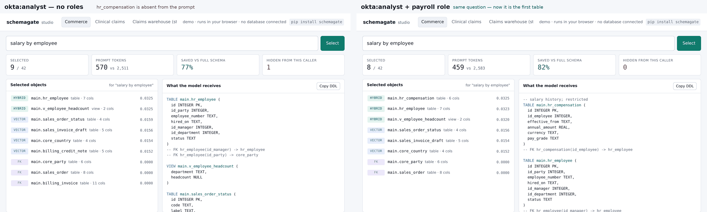

# schemagate

[](https://pypi.org/project/schemagate/)
[](https://pypi.org/project/schemagate/)
[](https://github.com/ashishsinha1602/schemagate/actions/workflows/ci.yml)
[](LICENSE)
[](https://ashishsinha1602.github.io/schemagate/)

Picks the handful of tables an NL2SQL model actually needs, and never shows it
tables the person asking isn't allowed to read.



*Same question, same person. Left: no `payroll` role, `hr_compensation` is absent
from the prompt — not ranked low, absent. Right: role added, it is the first
table. That decision happens before any SQL is written.
[Try it in the browser](https://ashishsinha1602.github.io/schemagate/) — no
install, no database, no model call.*

```bash
pip install schemagate
schemagate demo
```

That runs against a bundled 42-object schema. No database, no key, nothing to
configure. Then try it with the questions people actually type:

```bash
schemagate demo "which customers owe us money"
schemagate demo "salary by employee"                                   # restricted table absent
schemagate demo "salary by employee" --principal okta:hr --role payroll  # now it's there
schemagate demo "late shipments by carrier" --prompt                    # the DDL the model gets
```

Against your own database it's the same shape:

```bash
schemagate select "revenue by month" --url postgresql://localhost/app --principal okta:jdoe --role finance
schemagate studio --url postgresql://localhost/app        # the same thing, as a page
```

`schemagate studio` opens a local page where you type questions, switch the caller's
roles, edit hints, and watch what reaches the prompt and what doesn't. The same
page runs publicly at **https://ashishsinha1602.github.io/schemagate/** on the six
bundled schemas, in your browser, with no server behind it. The selector on that page is a JavaScript
port of this library, and a test runs both against 1,789 cases and requires
identical rankings.

If you're coming from Vanna (archived March 2026), `docs/migrating-from-vanna.md`
is the short version: Vanna applied identity when the SQL *ran*; schemagate applies
it before the model sees the schema. Your `User` maps to a `Principal` in one
line.

## What it saves

Every text-to-SQL call pays for the schema in the prompt. Dump the whole thing
and you pay for every table on every question; hand the model six tables and
you pay for six. Measured on the test schemas, average over their golden
questions, same built-in estimator as `tests/bench.py`:

| schema | objects | full schema, every call | schemagate, average | reduction |
|---|---:|---:|---:|---:|
| Commerce | 42 | 2,483 tokens | 604 | 76% |
| Clinical claims | 27 | 1,568 | 543 | 65% |
| Claims warehouse (star) | 51 | 3,312 | 880 | 73% |
| Bank ledger and trading | 39 | 2,255 | 637 | 72% |
| IoT telemetry | 40 | 2,125 | 448 | 79% |
| Hostile (4 schemas, copies of everything) | 260 | 16,095 | 444 | **97%** |

The last row is the one that matters: the selection stays around six tables
no matter how big the schema is, so the saving grows with the schema. Real
databases are the last row, not the first.

Worked example, with a price you should replace with your own: a 260-object
schema, 5,000 questions a day, an input price of $3 per million tokens. Full
schema: 16,095 × 5,000 × 30 = 2.4 billion tokens a month, about $7,200. With
schemagate: 444 × 5,000 × 30 = 67 million, about $200. The
[browser demo](https://ashishsinha1602.github.io/schemagate/) has these two
numbers as editable fields under the stats, so you can put in your own volume
and price and watch it recompute against whatever question you ask.

Two more things that cost nothing here and money elsewhere: the selector
itself never calls a model (BM25 plus a hashed embedder, offline,
milliseconds), and the optional descriptions can be written by any chat window
you already pay for instead of an API key — see
[Without an API key](#without-an-api-key).

## The problem this solves

Two things go wrong when you point an LLM at a database schema.

The first is cost. Most systems paste the whole schema into the prompt on every
question. That's fine for twenty tables and ruinous for two thousand.

The second is worse, and it's the reason I wrote this. Schema selection happens
*before* the query runs, so it happens before row-level security can do
anything. If your selection step isn't identity-aware, the model gets handed a
table the caller can't read. It writes perfectly good SQL. RLS or VPD filters
every row out. The user sees "no records found" and believes it.

That's not an access-denied message. It's a wrong answer with a confident tone,
and the user has no way to tell the difference. Filtering the catalog by
identity first is the only way I know to avoid it.

```python
from schemagate import Catalog, Principal

cat = Catalog().bootstrap("postgresql://localhost/app")
cat.hint("invoice_draft", "pre-issue drafts only, not real revenue")
cat.restrict("hr_compensation", ["payroll"])

sel = cat.select("revenue by month", top_k=6,
                 principal=Principal("okta:jdoe", roles={"finance"}))

sel.prompt_fragment()   # compact DDL, ready for the system prompt
sel.object_list         # [{'owner': ..., 'name': ...}]
sel.explain()           # why each object was picked
```

`hr_compensation` is not in that result and its name does not appear anywhere
in the prompt text.

## Install

```bash
pip install schemagate
```

That's the whole thing. One dependency (SQLAlchemy), no API key, no model
download. The default embedder is a hashed n-gram vectoriser that runs offline
and gives byte-identical results on every machine.

Extras, all optional:

```bash
pip install 'schemagate[postgres]'     'schemagate[oracle]'
pip install 'schemagate[mssql]'        'schemagate[mysql]'
pip install 'schemagate[anthropic]'    'schemagate[openai]'      'schemagate[gemini]'
pip install 'schemagate[huggingface]'
```

## How it picks

1. Reflect the schema through SQLAlchemy. No vendor SQL anywhere.
2. Index names, columns, comments, hints, and view definitions. That last one
   matters more than it sounds: a view exposes only its output columns, so
   `v_stock_shortfall` looks like it's about "shortfall" when the thing you'd
   search for, `reorder_point`, is buried in its SELECT.
3. Retrieve with reciprocal-rank fusion over BM25 and vector similarity.
   Neither alone is good enough. Vectors miss exact identifiers; BM25 misses
   "owe us money" → `balance`.
4. Walk foreign keys to pull in join tables the question never mentions. In my
   experience this is the single biggest cause of generated SQL that parses
   but won't run.
5. Apply the caller's identity at every step above.

## Numbers

Six test schemas ship with the library. Run `python tests/bench.py` and you
get all of this printed back. `TESTING.md` is the full record of what was
tested, what broke, and what was found to be the database rather than schemagate.

| | |
|---|---|
| recall@6, 12 questions, 42-object schema | 100% |
| recall@6, same schema, questions phrased in business words | 50% |
| recall@6, unrelated 27-object clinical schema | 100% |
| recall@6, hostile 260-object schema | 100% |
| recall@6, 51-object claims star schema with 15 backup/staging copies | 100% |
| recall@6, 39-object bank ledger and trading book | 100% |
| recall@6, 40-object IoT telemetry fleet | 100% |
| real table beats its backup/staging copy, 19 cases across schemas | 19/19 |
| recall without foreign-key expansion | 93.8% |
| prompt tokens, full schema every call | 2,583 |
| prompt tokens, schemagate average | 631 (−75.6%) |

Token counts come from an estimator built into the benchmark so the number is
reproducible with no network and no extra install. `pip install tiktoken` and
the same script switches to exact `cl100k_base` counts. The ratio holds either
way.

Six schemas rather than one because a single schema whose questions happen to
share vocabulary with its own table names will flatter any retriever. The
second is a different domain entirely. The third is 260 objects of deliberate
sabotage: an `_archive` and `_stg` copy of every table, the same table name in
three schemas, an 8-deep foreign-key chain, a reference cycle, composite keys,
a 320-column table, 100-character identifiers, and names in Spanish and
Japanese. The fourth is a claims warehouse star schema built so that several
tables are plausible for every question and one is right: the same fact at
four grains, a slowly-changing member dimension with a history table, one date
dimension joined five different ways, bridge tables, and fifteen `_bkp`,
`_old`, `_v2`, `_tmp` and `stg_` copies of the important ones. The fifth is a
bank: a ledger at three grains, trades versus positions versus settlements,
FX both as a daily table and an as-of view, lending, and the KYC and AML
tables most callers must never see. The sixth is an IoT fleet: readings at
raw, one-minute and hourly grains, six monthly partition tables, an alarm
lifecycle spread across three tables. All six are invented. No real schema
from anywhere is in this repo.

That 50% row is the honest one. Read it before you adopt this.

## The 50% row, and what to do about it

The default embedder matches subwords, not meaning. Ask it for "things we're
running out of" and it will not find `v_stock_shortfall`, because those two
strings have nothing in common. Ask it about `stock_shortfall` and it's
excellent.

If your users type identifier-shaped questions, you're done, and you never need
an API key. If they type like people, give the catalog descriptions. There are
two ways, and neither is required.

### Without an API key

Any chat window you already have — Claude.ai, ChatGPT, Gemini, Copilot, a
local model — can write the descriptions. schemagate gives you the prompt and
takes the reply:

```bash
schemagate describe --url postgresql://localhost/app --out prompt.txt
# paste prompt.txt into a chat; save its JSON reply as reply.json
schemagate describe --url postgresql://localhost/app --apply reply.json --config catalog.json
schemagate select   --url postgresql://localhost/app "things we're running out of" --config catalog.json
```

The prompt is metadata only — names, types, comments, foreign keys, never rows
— and one paste covers every undescribed object. The reply lands in the
`describe` block of `catalog.json`, next to your `restrict` and `hint` blocks,
and `select`, `studio` and the MCP server (`SCHEMAGATE_CATALOG_CONFIG`) all
read it. From Python it's the same idea: `cat.describe_prompt()` and
`cat.describe({"v_stock_shortfall": "Items below their reorder level."})`.

### With your own key

```python
from schemagate.ai import SchemaDescriber, AnthropicProvider

cat.describe(SchemaDescriber(AnthropicProvider(model="claude-sonnet-4-5"),
                             cache_path=".schemagate-cache.json"))
```

One sentence per table, written by the model, indexed like any other schema
text. On the bundled schema that takes the business-words row from 50% to 100%
with no change to the identifier-style questions.

Claude, GPT and Gemini are supported. Anything else goes through
`CallableProvider`, which is also your escape hatch when a vendor changes their
SDK and you don't want to wait for a release from me.

```python
from schemagate.ai import (AnthropicProvider, OpenAIProvider, GeminiProvider,
                      CallableProvider, auto_provider, available_providers)

AnthropicProvider(model="claude-sonnet-4-5")                    # ANTHROPIC_API_KEY
OpenAIProvider(model="gpt-4.1-mini")                            # OPENAI_API_KEY
GeminiProvider(model="gemini-2.5-flash")                        # GEMINI_API_KEY
OpenAIProvider(model="…", base_url="http://localhost:11434/v1") # anything local
CallableProvider(lambda system, prompt: my_llm(system, prompt))

available_providers()      # ['AnthropicProvider'] — names, never key values
auto_provider(model="…")   # picks whichever key is set
```

`model` is required. I'm not shipping a default model ID, because model IDs
change every few months and a hardcoded one eventually 404s for everybody who
installed the version before the fix.

Three things worth knowing before you turn this on:

**What leaves your network.** Table names, column names, types, nullability,
existing comments, foreign keys. Not one row of data — `ObjectDoc` has no field
that could hold one, and there are tests asserting both halves of that. Nothing
is sent unless you call `describe()`.

**What it costs.** One short call per undescribed object, once. Objects that
already have a database comment or a hint are skipped by default. Results cache
by content, so re-running is free and only changed tables get re-described. Ask
before you pay:

```python
describer.estimate_calls(docs)   # calls describe() would actually bill for
describer.preview(doc)           # the exact text that would be sent
```

**What happens when it fails.** The object is skipped, cataloging continues, and
`describer.failures` lists what was missed. Pass `strict=True` if you'd rather
it raise. A `hint()` you wrote by hand always beats a generated description, so
fixing a bad one costs nothing.

You can swap the embedder for a hosted one too, but benchmark it first. On
identifier-heavy schema text the offline embedder is often just as good and it
doesn't cost anything per query.

```python
from schemagate.ai import APIEmbedder, OpenAIProvider

provider = OpenAIProvider(model="gpt-4.1-mini",
                          embed_model="text-embedding-3-small")
cat = Catalog(embedder=APIEmbedder(provider, dim=1536))
```

## Databases

Reflection uses only SQLAlchemy's dialect-agnostic Inspector. There's no
hand-written SQL in `schemagate.introspect` and a test fails the build if any
appears, so in principle any dialect SQLAlchemy supports will work.

In principle isn't evidence, so there's a script:

```bash
python scripts/certify_dialect.py 'postgresql+psycopg://user:pw@host/db'
python scripts/certify_dialect.py 'oracle+oracledb://user:pw@host:1521/?service_name=FREEPDB1'
python scripts/certify_dialect.py 'mssql+pyodbc://user:pw@host/db?driver=ODBC+Driver+18+for+SQL+Server'
python scripts/certify_dialect.py 'mysql+pymysql://user:pw@host/db'
```

It creates three `schemagate_cert_` tables, reflects them, runs selection and
identity scoping end to end, drops them again, and exits non-zero if anything
failed. Point it at a scratch schema.

| | |
|---|---|
| SQLite | certified, 10/10, in CI |
| PostgreSQL | certified, 10/10 on PostgreSQL 16, plus the full 260-object suite |
| Oracle | certified live on Oracle AI Database 26ai (Autonomous Database), Sep 2026: certify script 10/10, the native `VECTOR(512, FLOAT32)` store conformance suite, and the dialect suite. Also stress-tested against a 127-object, 3-domain schema with ~7M rows |
| SQL Server | not yet run against a live instance |
| MySQL / MariaDB | not yet run against a live instance |

The bottom two say what they say because I haven't had a live instance to run
them against, not because I expect trouble. Run the script and tell me what
happens.

The same checks run under pytest if you export a URL, which is how CI certifies
a dialect for good:

```bash
export SCHEMAGATE_POSTGRES_URL='postgresql+psycopg://…'
export SCHEMAGATE_ORACLE_URL='oracle+oracledb://…'
export SCHEMAGATE_MSSQL_URL='mssql+pyodbc://…'
export SCHEMAGATE_MYSQL_URL='mysql+pymysql://…'
pytest tests/test_dialects.py -v
```

## Using it from an agent

If you already have an agent that writes SQL, the fastest way in is to let it
call schemagate as a tool rather than wiring the library into your code.

**MCP.** Cursor, Windsurf, Zed, or anything else that speaks the
Model Context Protocol:

```bash
pip install 'schemagate[mcp]'
SCHEMAGATE_DATABASE_URL=postgresql://localhost/app python -m schemagate.mcp_server
```

MCP client config:

```json
{"mcpServers": {"schemagate": {
  "command": "python", "args": ["-m", "schemagate.mcp_server"],
  "env": {"SCHEMAGATE_DATABASE_URL": "postgresql://localhost/app"}}}}
```

Three tools: `select_schema` (the DDL for a question, scoped to the caller),
`list_objects` (what this caller can see), `describe_object` (one object's full
DDL). All three take `principal` and `roles`. If the client leaves them out,
the caller is anonymous and sees only unrestricted objects. A restricted
object and a missing one return the same error, so existence doesn't leak.
`SCHEMAGATE_DATABASE_URL=demo` serves the bundled schema.

To host it for a team rather than one desktop:

```bash
SCHEMAGATE_MCP_TRANSPORT=streamable-http SCHEMAGATE_MCP_PORT=8765 python -m schemagate.mcp_server
```

It's built not to die. The index lives in memory after startup, so the
database going away does not take the server with it — `select_schema` keeps
answering from the last good reflection, and `refresh_catalog` reports the
failure instead of raising. Every tool catches everything and returns
`{"error": ...}`; a bad request cannot end the session for other clients.
`health` tells a load balancer what state it's in. A test throws 125 kinds of
garbage at every tool and then checks the next good request still works, and
another does the same through a real client over stdio. Works on MCP SDK 1.x
and 2.x; the 2.0 rename broke a fresh install once and there's a shim and a
test for it now.

**LangChain.** A proper `BaseRetriever`, so it composes:

```bash
pip install 'schemagate[langchain]'
```

```python
from schemagate.integrations.langchain import SchemagateRetriever, prompt_fragment

retriever = SchemagateRetriever(catalog=cat, top_k=6,
                           principal=Principal("okta:jdoe", roles={"finance"}))
chain = retriever | RunnableLambda(prompt_fragment) | your_sql_prompt | llm
```

The principal is bound at construction on purpose. Build one retriever per
caller; a chain can't forget to pass identity if the retriever already has it.

## On Oracle Cloud

Certified live on Oracle AI Database 26ai. Two ways in, neither of which needs
an API key — cataloguing runs on OCI Generative AI under your own OCI identity,
so the prompts (schema metadata only, never rows) stay in your tenancy.

**From Cloud Shell, about a minute, no VM:**

```bash
pip install --user 'schemagate[oracle,oci]'
schemagate describe --url 'oracle+oracledb://@' --provider oci \
    --model google.gemini-2.5-pro --config catalog.json
```

**Or one click, for an MCP endpoint that stays up for your team:**

[](https://cloud.oracle.com/resourcemanager/stacks/create?zipUrl=https://github.com/ashishsinha1602/schemagate/releases/latest/download/schemagate-oci-stack.zip)

That opens Resource Manager in your own tenancy with the stack loaded — an
Always-Free-eligible VM running the MCP server against an Autonomous Database
it creates, or one you already have. Details and the Terraform: [`oci/`](oci/).

## Keeping the index in Oracle

`MemoryStore` rebuilds on every process start. Fine for a few hundred objects,
wrong for a long-lived service. `OracleStore` keeps vectors in Oracle 23ai's
native `VECTOR` type so the nearest-neighbour search runs in the database:

```python
from schemagate.stores.oracle import OracleStore

store = OracleStore(dsn="user/pw@host:1521/FREEPDB1", dim=512)
store.create_schema()                       # idempotent

cat = Catalog(store=store).bootstrap("oracle+oracledb://…")
```

Pass `connection=` instead of `dsn=` to reuse your app's pool. It won't close a
connection it didn't open.

Scoping is a predicate inside the scored subquery, not a filter applied after
the rows come back. A row the caller can't see is never ranked and never leaves
the database.

Same caveat as above: 26 tests pin the SQL, the bind types and the scope
predicate, and every statement is checked against an independent Oracle parser,
but none of it has run against a live 23ai instance yet. To do that:

```bash
export SCHEMAGATE_ORACLE_DSN='user/password@host:1521/FREEPDB1'
pytest tests/test_store_conformance.py -v
```

Oracle Cloud's Always Free ATP is enough.

## Things that will bite you

**Archive and staging twins are handled, but know how.** If your warehouse has
`orders`, `orders_bkp` and `stg_orders`, the copies carry the same name words in
a shorter document, and cosine similarity likes short documents. Left alone,
a three-column `_tmp` copy beats the twenty-five-column table it was copied
from, even with a hint on the real one — I watched it happen. So an object
whose name is a real object's name plus `_bkp`, `_old`, `_tmp`, `_v2`,
`_archive` and so on, or `stg_`/`tmp_` in front, is ranked below the object it
shadows. Only when that object exists: a lone `pricing_v2` with no `pricing`
is left alone. Only in the same schema. And never when you name the copy
outright — asking for `fact_claim_line_v2` gets you `fact_claim_line_v2`. The
lists are `DEFAULT_SHADOW_SUFFIXES` and `DEFAULT_SHADOW_PREFIXES`; pass your
own to `Catalog(...)`, or empty tuples to switch it off. `cat.shadows()` shows
what was detected.

**Identifier length.** PostgreSQL truncates names to 63 bytes at creation.
That's the database doing it, not schemagate, and there's nothing to be done from
this side.

**Non-English schemas** work, including Chinese, Japanese and Korean, and
accents fold both ways so a search for `facturacion` finds `facturación`. But a
question in English will not find a table named in Spanish. Nothing lexical can
bridge that. Descriptions can.

**`top_k` is not a hard cap.** Foreign-key expansion runs after selection and
adds join tables on top. That's deliberate — SQL that references a table you
didn't include won't run — but size your prompt budget for it.

## Status

v0.1. Alpha, and the API may still move.

| | |
|---|---|
| Reflection | certified on SQLite and PostgreSQL |
| `MemoryStore` | done |
| AI cataloging | done, tested offline against fake providers |
| CLI | done |
| Studio (`schemagate studio`, and the hosted demo) | done, driven by a real browser in tests |
| MCP server | done, tested through a real MCP client |
| LangChain retriever | done, tested against langchain-core |
| `OracleStore` | written and statically verified, needs a live run |
| pgvector store | not started |

`import schemagate` never imports any provider SDK, and there's a test asserting it.

Default embeddings are stable across processes, machines and Python versions,
so cached or persisted vectors stay valid. That one is enforced by a test that
runs the embedder in fresh subprocesses under different `PYTHONHASHSEED`
values, because it was broken once and nothing else caught it.

Apache-2.0. Ashish Sinha.
